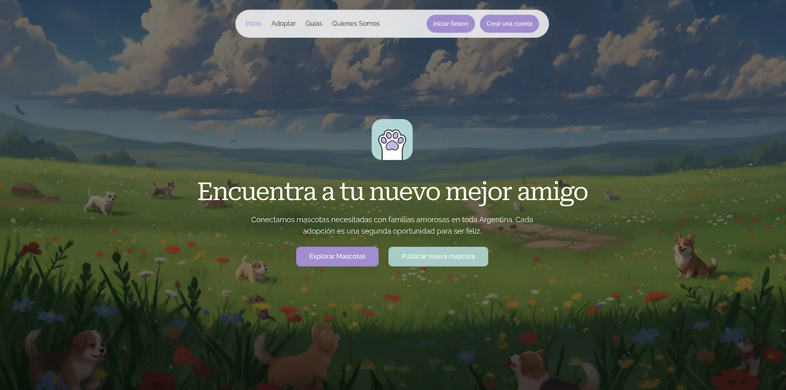

<div align="center">
  <picture>
    
  </picture>
  <h1 align="center">Patitas</h1>
  <p align="center">
    Platform for responsible pet adoption, connecting shelters and adopters in a simple and secure way.
  </p>
</div>

<br>

## What is Patitas?

Patitas is a platform designed to facilitate the responsible adoption of pets. 🐾 Its goal is to connect shelters, rescuers, and adopters in a modern, reliable, and accessible environment.

<br>

<div align="center">
  
</div>

<br>

## Features

- Search pets — Explore profiles with photos, descriptions, and location
- Create your profile — Show who you are and why you want to adopt
- Publish pets — Create complete profiles with images and details
- Direct contact — Communicate with shelters and owners
- Update status — Mark pets as available, in process, or adopted
- Care guides — Learn about responsible animal care
- Edit profile — Keep your information up to date

The mission of the project is to reduce the number of homeless animals and streamline the adoption process.

<br>

## 🛠️ Tech Stack

<div align="start">

#### Frontend

Next.js • TypeScript • Tailwind CSS • Shadcn/UI • React Hook Form • Zod

#### Backend / API

Node.js • Express • Supabase (Auth + Database + Storage)

#### Infrastructure

Vercel (Frontend) • Railway (Backend)

</div>

<br>

## Setup

```bash
# Clone the repository
git clone https://github.com/francogalfre/patitas.git
cd patitas

# Install dependencies
bun install
bun dev
```

<br>

## Contributing

We welcome contributions from the community! Whether you're fixing bugs, adding features, or improving documentation, your help is appreciated 🤝.

Please read our [Contributing Guide](CONTRIBUTING.md) for details on:

- Development setup and workflow
- Coding standards and best practices
- Testing requirements
- Pull request process
- How to report issues

Quick start for contributors:

```bash
# Fork and clone the repository
git clone https://github.com/francogalfre/patitas.git
cd patitas

# Install dependencies
bun install

# Make your changes, add tests, then run quality checks
bun lint && bun format && bun test

# Create a pull request
```

<br>

## License

📄 MIT License - see [LICENSE](LICENSE) for details.

<br>
<br>

<div align="center">
  Made with ❤️ by <a href="https://github.com/francogalfre">@francogalfre</a>
</div>
